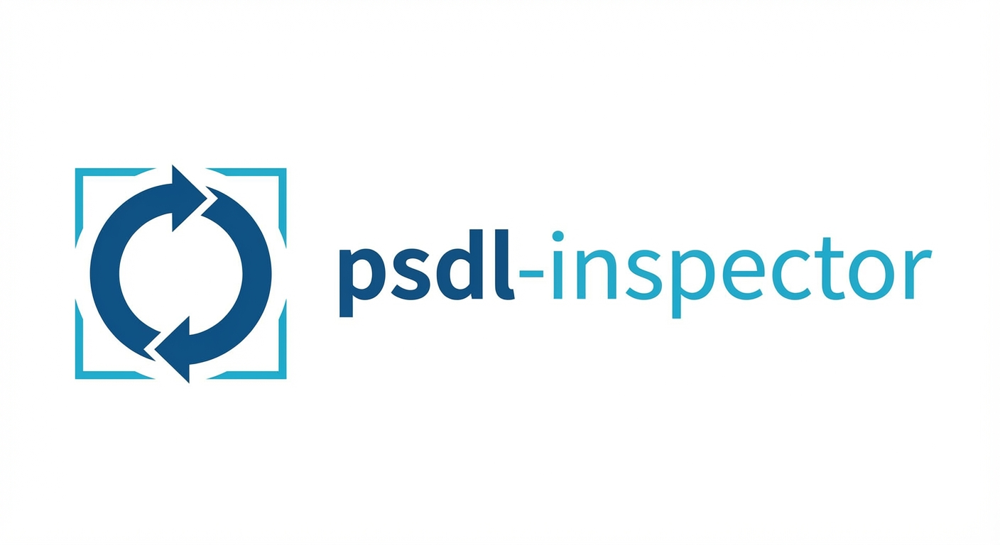

<p align="center">
  
</p>

<p align="center">
  <a href="https://github.com/Chesterguan/psdl-inspector"></a>
  <a href="https://pypi.org/project/psdl-lang/"></a>
  <a href="LICENSE"></a>
  <a href="https://zread.ai/Chesterguan/psdl-inspector" target="_blank"></a>
</p>

# PSDL Inspector

**Governance middleware for clinical scenarios.**

PSDL Inspector validates, visualizes, and certifies [PSDL](https://github.com/Chesterguan/PSDL) scenarios, producing audit-ready bundles for regulatory compliance.

```
┌─────────────────────────────────────────────────────────────┐
│                    PSDL ECOSYSTEM                           │
│                                                             │
│  ┌─────────────┐    ┌─────────────┐    ┌─────────────────┐ │
│  │  AUTHORING  │ →  │  INSPECTOR  │ →  │    PLATFORM     │ │
│  │  (YAML)     │    │ (Certify)   │    │   (Execute)     │ │
│  └─────────────┘    └─────────────┘    └─────────────────┘ │
│                                                             │
│  psdl-lang          psdl-inspector     (your runtime)      │
└─────────────────────────────────────────────────────────────┘
```

## Compatibility

| Inspector Version | psdl-lang Version | PSDL Spec | Status |
|-------------------|-------------------|-----------|--------|
| 0.1.x | 0.3.1 | 0.3 | **Current** |
| - | 0.2.x | 0.2 | Not supported |
| - | < 0.2 | - | Not supported |

> **Note**: PSDL Inspector requires psdl-lang 0.3.x. The psdl-lang library provides parsing, validation, and IR generation that Inspector builds upon.

## Features

| Feature | Description |
|---------|-------------|
| **Generate** | AI-assisted scenario creation with OpenAI or local Ollama |
| **Validate** | Real-time syntax and semantic validation via psdl-lang |
| **Visualize** | Interactive DAG view with ReactFlow (signal → trend → logic) |
| **Outline** | Semantic tree navigation of scenario structure |
| **Bundle** | Generate checksummed certified bundles |
| **Export** | IRB preparation with AI-enriched Word document export |

## What Inspector Does NOT Do

Inspector is **governance middleware** — it certifies that algorithms are correct. It does not execute them.

| Out of Scope | Reason |
|--------------|--------|
| Connect to patient data (EHR, OMOP, FHIR) | Execution platform responsibility |
| Execute scenarios in production | Execution platform responsibility |
| Send clinical alerts | Execution platform responsibility |
| Handle PHI/HIPAA data | No patient data in certification |

## Quick Start

### Requirements

- Python 3.9+
- Node.js 18+
- psdl-lang 0.3.1 (installed automatically)

### 1. Clone Repository

```bash
git clone https://github.com/Chesterguan/psdl-inspector.git
cd psdl-inspector
```

### 2. Backend Setup

```bash
cd backend
python -m venv .venv
source .venv/bin/activate  # Windows: .venv\Scripts\activate
pip install -r requirements.txt
uvicorn app.main:app --reload --port 8200
```

API available at http://localhost:8200

### 3. Frontend Setup

```bash
cd frontend
npm install
npm run dev
```

App available at http://localhost:9806

### 4. Configure AI (Optional)

For AI-assisted scenario generation:

```bash
# Option 1: OpenAI (recommended - fast, accurate)
export OPENAI_API_KEY="sk-your-key-here"

# Option 2: Local Ollama (private, no API key needed)
brew install ollama
ollama serve
ollama pull mistral-small
```

### 5. Verify Installation

Navigate to http://localhost:9806. The header should display:
```
Inspector v0.1.0
psdl-lang v0.3.1
```

## Wizard Workflow

PSDL Inspector uses a 3-step wizard workflow:

### Step 1: Input
- **Generate Tab**: AI-assisted scenario creation from natural language
  - OpenAI GPT-4o-mini (cloud, recommended)
  - Ollama (local, privacy-preserving)
  - Auto-validation and error correction
  - Optional clinical context for accurate thresholds
- **Editor**: Manual YAML editing with CodeMirror
- **Validation Panel**: Real-time syntax and semantic validation

### Step 2: Preview
- **Outline**: Tree view of signals, trends, and logic with dependency tracking
- **DAG**: Interactive ReactFlow graph visualization
  - Custom node shapes (parallelogram, rounded rect, diamond, hexagon)
  - Severity-based coloring for logic nodes
  - Node details panel on hover
- **Bundle**: Certified audit bundle preview with checksum and governance checklist

### Step 3: Export
- **Governance Documentation**: Clinical summary, justification, risk assessment
- **JSON Bundle**: Checksummed certified audit bundle for downstream systems
- **Word Document**: AI-enriched IRB documentation with:
  - Executive summary and clinical background
  - Algorithm overview and data elements
  - Safety considerations and limitations
  - Technical appendix

## Architecture

```
┌─────────────────────────────────────────────────────────────────┐
│                     Frontend (Next.js)                          │
│  ┌──────────┐  ┌──────────┐  ┌──────────┐  ┌───────────────┐   │
│  │ Generate │→ │ Editor   │→ │ Preview  │→ │    Export     │   │
│  │ (AI)     │  │ (YAML)   │  │ DAG/Tree │  │ Bundle + Word │   │
│  └──────────┘  └──────────┘  └──────────┘  └───────────────┘   │
└────────────────────────────┬────────────────────────────────────┘
                             │ REST API
┌────────────────────────────▼────────────────────────────────────┐
│                     Backend (FastAPI)                           │
│  ┌──────────────┐  ┌──────────────┐  ┌────────────────────┐    │
│  │ /generate    │  │ /validate    │  │ /export/bundle     │    │
│  │ /outline     │  │              │  │ /export/irb-doc    │    │
│  └──────────────┘  └──────────────┘  └────────────────────┘    │
│         │                 │                    │                │
│  ┌──────▼──────┐  ┌───────▼───────┐  ┌────────▼─────────┐      │
│  │  OpenAI /   │  │   psdl-lang   │  │   python-docx    │      │
│  │   Ollama    │  │  (validation) │  │  (Word export)   │      │
│  └─────────────┘  └───────────────┘  └──────────────────┘      │
└─────────────────────────────────────────────────────────────────┘
```

## API Reference

### GET /api/version
Returns version information.
```json
{
  "inspector": "0.1.0",
  "psdl_lang": "0.3.1"
}
```

### GET /api/generate/status
Check LLM provider availability.
```json
{
  "openai": { "available": true, "model": "gpt-4o-mini" },
  "ollama": { "available": true, "model": "mistral-small", "models": [...] },
  "default_provider": "openai"
}
```

### POST /api/generate/scenario
Generate PSDL scenario from natural language.
```json
{
  "prompt": "Detect AKI using creatinine changes",
  "provider": "openai",
  "max_retries": 3,
  "clinical_context": "KDIGO criteria..."
}
```

### POST /api/validate
Validate a PSDL scenario.

### POST /api/outline
Generate semantic outline with dependency tracking.

### POST /api/export/bundle
Export certified audit bundle with checksum.

### POST /api/export/irb-document
Export AI-enriched Word document for IRB preparation.

## Certified Audit Bundle

Inspector outputs **Certified Audit Bundles** — the contract between authoring and execution:

```json
{
  "bundle_version": "1.0",
  "certified_at": "2025-12-15T10:30:00Z",
  "checksum": "sha256:abc123...",

  "scenario": {
    "name": "AKI_Detection",
    "version": "0.3.1"
  },

  "validation": {
    "psdl_lang_version": "0.3.1",
    "valid": true,
    "errors": [],
    "warnings": []
  },

  "audit": {
    "intent": "Detect early AKI...",
    "rationale": "KDIGO guidelines...",
    "provenance": "doi:10.1038/..."
  },

  "summary": "Human-readable summary for IRB..."
}
```

## Tech Stack

| Component | Technology |
|-----------|------------|
| Frontend | Next.js 14, React 18, Tailwind CSS |
| Editor | CodeMirror 6 |
| Visualization | ReactFlow, dagre (auto-layout) |
| Backend | FastAPI, Python 3.9+ |
| Validation | psdl-lang 0.3.1 |
| AI Generation | OpenAI GPT-4o-mini, Ollama |
| Document Export | python-docx |

## Related Projects

| Project | Description | Link |
|---------|-------------|------|
| **PSDL** | Patient Scenario Definition Language spec | [GitHub](https://github.com/Chesterguan/PSDL) |
| **psdl-lang** | Python library for PSDL parsing | [PyPI](https://pypi.org/project/psdl-lang/) |

## Roadmap

- [x] AI-assisted scenario generation (OpenAI + Ollama) ✅
- [x] Interactive DAG visualization with ReactFlow ✅
- [x] AI-enriched IRB Word document export ✅
- [ ] Editable DAG (visual scenario editing)
- [ ] Lint rules (best practices, style checks)
- [ ] Scenario registry with versioning
- [ ] Semantic diff (structural, not text)

## Contributing

Contributions welcome! Please:

1. Fork the repository
2. Create a feature branch (`git checkout -b feature/amazing-feature`)
3. Commit your changes
4. Push to the branch (`git push origin feature/amazing-feature`)
5. Open a Pull Request

### Development Setup

```bash
# Backend (with hot reload)
cd backend && source .venv/bin/activate
uvicorn app.main:app --reload --port 8200

# Frontend (with hot reload)
cd frontend && npm run dev
```

### Code Style

- Python: Follow PEP 8
- TypeScript: ESLint + Prettier
- Commits: Conventional commits preferred

## License

MIT License - see [LICENSE](LICENSE) for details.

---

*Built for teams who take clinical algorithm governance seriously.*
