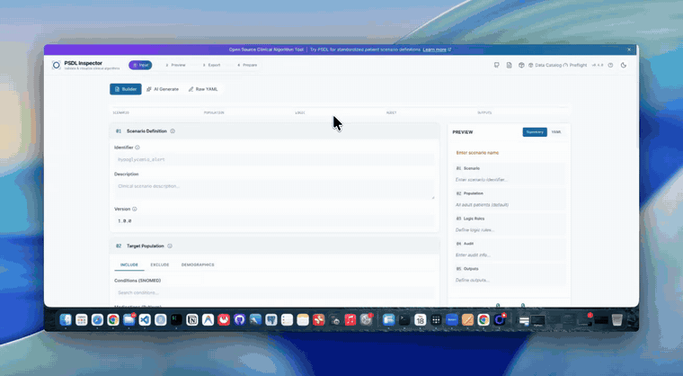

<p align="center">
  
</p>

<p align="center">
  <a href="https://github.com/Chesterguan/psdl-inspector"></a>
  <a href="https://pypi.org/project/psdl-lang/"></a>
  <a href="LICENSE"></a>
</p>

<h1 align="center">PSDL Inspector</h1>

<p align="center"><b>Describe a clinical cohort or detection rule in one sentence — get back a validated, audit-ready algorithm.</b></p>

PSDL Inspector turns plain English into a **checked clinical scenario**: a visual DAG, OMOP terminology anchoring, a checksummed *certified bundle*, and a real-database **cost preflight** — without writing a line of [PSDL](https://github.com/Chesterguan/PSDL) by hand.



```bash
git clone https://github.com/Chesterguan/psdl-inspector.git
cd psdl-inspector && docker compose up        # → http://localhost:9806
```

**[▶ 13-second demo](docs/demos/aki-preflight.gif) · [5-minute quickstart](QUICKSTART.md) · [Full walkthrough on YouTube](https://youtu.be/j-3UHeCyHDk) · [Docs](docs/)**

- **Describe it, don't code it** — one sentence → a validated PSDL scenario, AI-generated and auto-checked against `psdl-lang`. No new syntax to learn.
- **See the logic** — an interactive DAG + semantic outline surface errors at authoring time, not at IRB review.
- **Hand it off** — a checksummed certified bundle with OMOP anchors + an IRB-ready Word doc, and a SQL preflight that reads **GO / CAUTION / BLOCK** *before* a query ever touches the warehouse.

<!-- Workbench has no public landing page yet; CTA points at email. Swap for a domain address / form when ready. -->
> Inspector is the free, single-user tool. Need a scenario **registry**, role-based review/approval, IRB templates, and SSO across a team? → **PSDL Workbench** *(commercial)* — [request access or info](mailto:chesterfield199512@gmail.com?subject=PSDL%20Workbench%20inquiry).

---

## How it works, in 30 seconds

One clinical sentence becomes a scenario that is generated, validated, and costed against a real **288M-row MIMIC-IV/OMOP** database — the preflight runs a real `EXPLAIN` (metadata only; it never executes the query or reads a patient row):


```
"Detect and stage acute kidney injury by the KDIGO criteria using serum creatinine."
        ↓  AI generates PSDL          (gpt-4o-mini, auto-retried until valid)
        ↓  validates                  (real thresholds, real KDIGO stages)
        ↓  anchors to OMOP            (creatinine → LOINC 2160-0, concept 3016723)
        ↓  certifies                  (checksummed bundle, IRB Word doc)
        ↓  preflights on real data    🟢 GO   (real EXPLAIN, nothing executed)
```

Reproduce it yourself: [`docs/demos/`](docs/demos/) ships the scenario YAMLs, narrator cue sheets, and the recording script.

## Who it's for

| You are… | Inspector gives you… |
|----------|----------------------|
| A **clinical researcher / cohort builder** | A sentence → a checked, shareable algorithm you can hand to a data team — no SQL, no DSL to learn first |
| A **data engineer / informaticist** | A readable DAG + semantic diff of the logic, OMOP anchoring, and a preflight that catches a cartesian-join blow-up before it hits the warehouse |
| An **IRB / compliance reviewer** | A checksummed certified bundle + AI-enriched Word doc with intent, rationale, provenance, and a clear audit boundary |

Where Inspector sits in the chain — it **certifies** algorithms; it never executes them ([what that means →](docs/architecture.md)):

```
┌─────────────┐    ┌─────────────┐    ┌─────────────────┐
│  AUTHORING  │ →  │  INSPECTOR  │ →  │    PLATFORM     │
│  (sentence  │    │ (validate + │    │   (execute on   │
│   or YAML)  │    │   certify)  │    │  patient data)  │
└─────────────┘    └─────────────┘    └─────────────────┘
   psdl-lang        psdl-inspector      your runtime / Workbench
```

## Try it

```bash
git clone https://github.com/Chesterguan/psdl-inspector.git
cd psdl-inspector && docker compose up        # → http://localhost:9806
```

The image bundles the OMOP vocabulary for terminology search, so the first build takes a few minutes. **AI generation** needs a key (optional): `cp .env.example .env` and set `OPENAI_API_KEY=sk-...`, or use a local model (`brew install ollama && ollama serve && ollama pull mistral-small`).

Full local (non-Docker) setup → the **[5-minute quickstart](QUICKSTART.md)**. Self-hosting, the anchoring-engine choice, and the wizard walkthrough → **[docs/](docs/)**.

## Features

| Feature | Description |
|---------|-------------|
| **Generate** | One sentence → a validated scenario, via OpenAI or local Ollama, auto-retried until it passes |
| **Build** | Visual scenario builder with guided workflow and OMOP vocabulary search |
| **Validate** | Real-time syntax and semantic validation via psdl-lang |
| **Visualize** | Interactive DAG view (signal → trend → logic) + semantic outline tree |
| **Anchor** | Automatic terminology binding to OMOP vocabulary at export |
| **Bundle** | Checksummed certified bundles with terminology anchors |
| **Export** | IRB preparation with AI-enriched Word document export |
| **MEDS Preview** | Synthesize a 10-row MEDS-format Parquet preview from anchored signals, no DB required |
| **Data Catalog** | Read-only browse of an Observatory-scanned data lake (schemas, columns, inferred roles) |
| **Preflight** | SQL cost/risk check (GO / CAUTION / BLOCK) before a query touches the warehouse — offline by default; optional real `EXPLAIN` against your own local DB |

## More demos

▶ **[Sepsis-3 qSOFA walkthrough on YouTube](https://youtu.be/j-3UHeCyHDk)** — a full pipeline run (Builder/YAML → Validate → Outline → DAG → Anchor → Certified Bundle → IRB Word export → MEDS Preview).

[](https://youtu.be/j-3UHeCyHDk "Watch on YouTube")

Two reproducible scenarios ship under [`docs/demos/`](docs/demos/) (sepsis screen; T2DM + diabetic nephropathy on metformin) with scenario YAMLs, narrator cue sheets, and a DevTools loader.

## Documentation

| | |
|---|---|
| **[Quickstart](QUICKSTART.md)** | Zero to a certified algorithm in 5 minutes |
| **[Using Inspector](docs/usage.md)** | Wizard workflow + the BioLORD/legacy anchoring engine choice |
| **[API & bundle reference](docs/reference.md)** | REST endpoints, certified bundle schema, MEDS preview, compatibility |
| **[Architecture & scope](docs/architecture.md)** | System design + what Inspector does/doesn't do |
| **[Execution contract](docs/EXECUTION_CONTRACT.md)** | How execution platforms consume the certified bundle |
| **[Deployment](docs/DEPLOYMENT.md)** | Docker / Vercel / Render |

Full index: **[docs/](docs/)**.

## Related projects

| Project | Description | Link |
|---------|-------------|------|
| **PSDL** | Patient Scenario Definition Language spec | [GitHub](https://github.com/Chesterguan/PSDL) |
| **psdl-lang** | Python library for PSDL parsing | [PyPI](https://pypi.org/project/psdl-lang/) |
| **psdl_meds** | MEDS writer + validator, embedded here and reused by Workbench | [backend/psdl_meds/](backend/psdl_meds/) |
| **PSDL Workbench** | Institutional platform for live cohort execution + governance | Commercial (closed-source / SaaS) |

## Roadmap

- [x] AI-assisted scenario generation (OpenAI + Ollama)
- [x] Interactive DAG visualization with ReactFlow
- [x] AI-enriched IRB Word document export
- [x] Visual scenario builder with guided workflow
- [x] Terminology anchoring (OMOP vocabulary binding)
- [x] MEDS preview + `psdl-meds` CLI (shared library with PSDL Workbench)
- [ ] Editable DAG (visual scenario editing)
- [ ] Lint rules (best practices, style checks)
- [ ] Scenario registry with versioning
- [ ] Semantic diff (structural, not text)

## Contributing

Contributions welcome — see [CONTRIBUTING.md](CONTRIBUTING.md). Python: PEP 8 + type hints. TypeScript: ESLint + Prettier, strict mode. Commits: [Conventional Commits](https://www.conventionalcommits.org/).

## License

MIT — see [LICENSE](LICENSE).

---

*Built for teams who take clinical algorithm governance seriously.*
