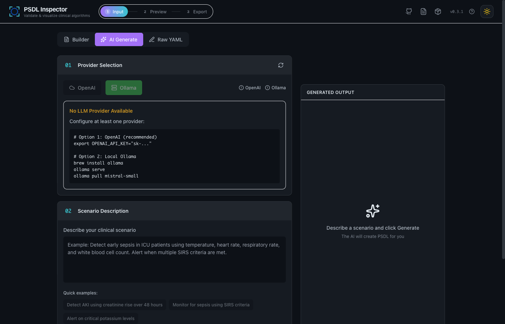
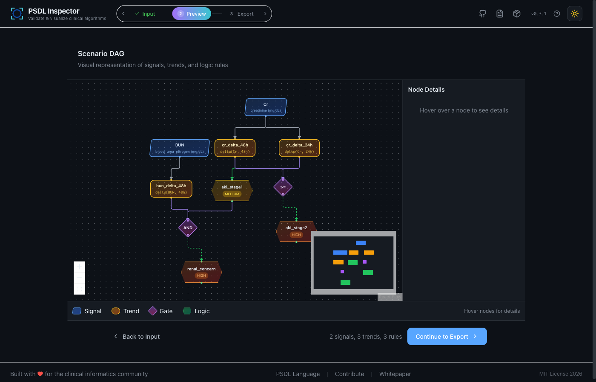
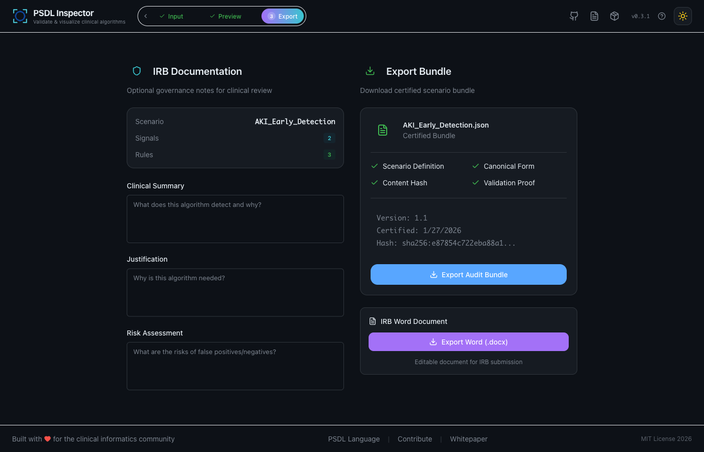

# Using Inspector

## Wizard workflow (Input → Preview → Export → Prepare)

### Step 1: Input — three modes
- **Generate** — natural language → scenario (OpenAI GPT-4o-mini cloud, or Ollama local), auto-validation and error correction, optional clinical context for accurate thresholds.
- **Builder** — constrained visual builder: signal selection with OMOP search, trend config, logic rules with severity, outputs, and the audit section (intent, rationale, provenance).
- **Editor** — manual YAML with CodeMirror: syntax highlighting, auto-completion, line numbers, template insertion, real-time validation.

Alternatives to Generate: the [Builder](img/screenshots/01-builder-mode.png) (visual, with OMOP search) and the [raw YAML editor](img/screenshots/03-raw-yaml-mode.png). Validation runs live — flagging [errors](img/screenshots/04-validation-error.png) as you type, green when it [passes](img/screenshots/05-validation-success.png).

### Step 2: Preview
- **Outline** — tree of signals, trends, and logic with dependency tracking.
- **DAG** — interactive ReactFlow graph: custom node shapes, severity-based coloring, hover detail panel.
- **Bundle** — certified audit bundle preview with checksum and governance checklist.

### Step 3: Export
- **Governance Documentation** — clinical summary, justification, risk assessment.
- **JSON Bundle** — checksummed certified audit bundle with terminology anchors.
- **Word Document** — AI-enriched IRB doc: executive summary, clinical background, algorithm overview, data elements, safety considerations, limitations, technical appendix.

### Step 4: Prepare
- **Data Catalog** — browse an Observatory-scanned data lake (read-only).
- **Preflight** — offline or live-DB SQL cost/risk check before extraction.

## Terminology anchoring engine — BioLORD (default) vs legacy

OMOP anchoring (and vocab search) can run on two engines, set via `ANCHORING_ENGINE` in `docker-compose.yml` (or the backend environment):

- **`biolord_v2` (default)** — highest quality (BioLORD-2023 embeddings + clinical reranker). The embedder is baked into the image; a ~1.7GB concept index downloads **once** on the first anchor and is cached in the `vocab_cache` Docker volume (first anchor ~100s, instant after). Best for accuracy.
- **`` (empty) → legacy** — lighter and offline (no 1.7GB download), but lower-quality matches (no domain reranking). Set `ANCHORING_ENGINE=` to use it.

Either way, the cold cost is one-time; subsequent anchors are instant. Generation-time vocab enrichment is off by default (`GENERATE_SKIP_ENRICHMENT=1`); OMOP binding still happens at export anchoring.
